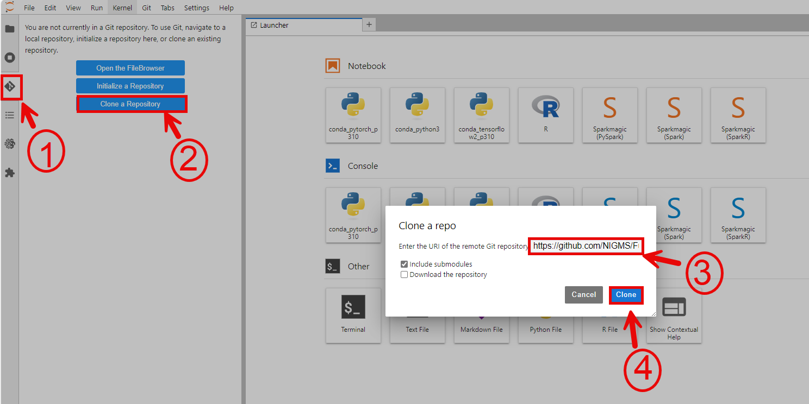
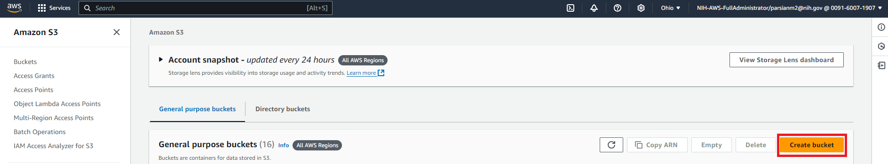
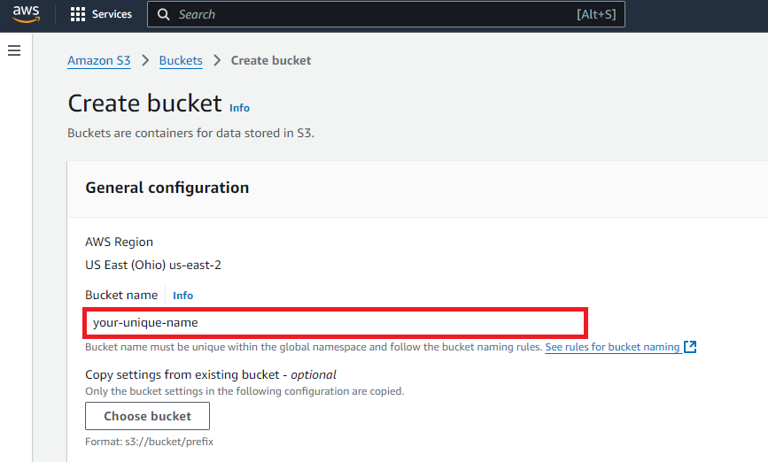
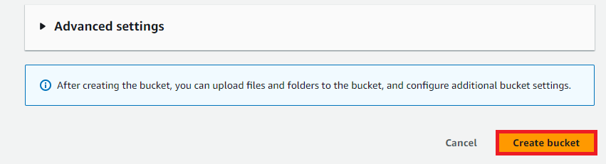
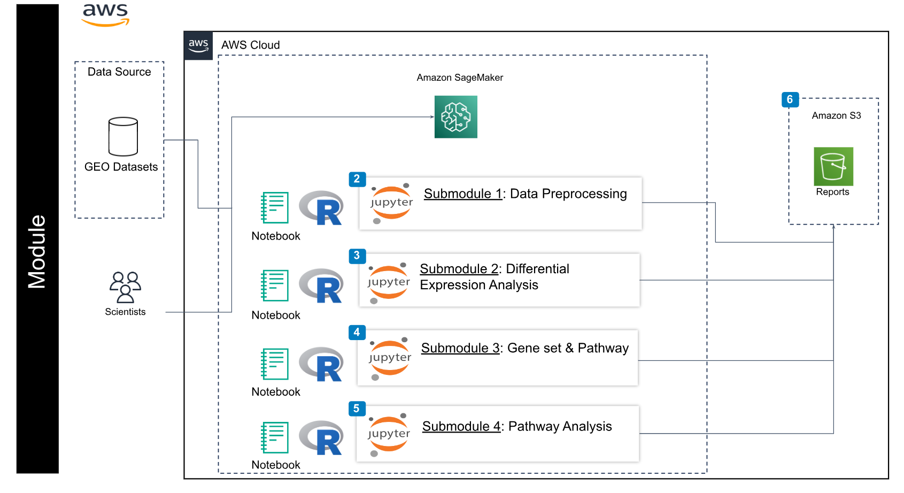

## Contents

+ [Getting Started](#getting-started)
+ [Creating a notebook instance with R kernel in Google Cloud](#notebook-instance)
+ [Creating Google Cloud Storage Buckets](#google-cloud-bucket)
+ [Google Cloud Architecture](#google-cloud-architecture)

## Getting Started
Each learning submodule will be organized in an R Jupyter Notebook with step-by-step hands-on practice using R command-line tools to install necessary tools, obtain data, perform analyses, visualize, and interpret the results.  The notebook will be executed in the AWS environment. Therefore, the first step is to set up a notebook instance in AWS SageMaker.


## Creating a JupyterLab with a custom image 

Follow the steps highlighted [here](https://github.com/NIGMS/NIGMS-Sandbox/blob/main/docs/HowToCreateJupyterlabWithCustomImage.md) to run a JupyterLab with a custom Docker image. 

+ In step 4, use the URL `public.ecr.aws/v8e3m3v4/sagemaker-studio/r:latest` from Amazon Elastic Container Registry.

**Stop your JupyterLab at the end of your work to avoid incurring extra charges.**


## Clone from GitHub

Use the URL `https://github.com/NIGMS/Consensus-Pathway-Analysis-in-the-Cloud.git` to clone the repository from GitHub.

# 

## Creating Amazon S3 Buckets
This section describes how to create AWS S3 buckets to store data generated during the analysis. The bucket can be created using the GUI or the command line.

To use the GUI, first visit https://console.aws.amazon.com/s3, sign in, and click on **Create bucket** on the right.

# 

This opens a page where you provide a unique bucket name, location, access control, and other information.  We named our bucket `your-unique-name` (remember to create your own unique name).

# 

Then, click the **Create bucket** button to complete the process.

# 

To create an S3 bucket using the command line, use the AWS CLI command `aws s3 mb`:

```bash
aws s3 mb s3://BUCKET_NAME
```

where `BUCKET_NAME` is the user-defined name.  A success message is returned if the request is successful. You can add optional parameters for greater control. These parameters are typically specified using options like `--<parameter_name> <value>`.

Some common options include:

* **`--region REGION`:** Specifies the AWS Region (e.g., `--region us-west-2`). This is **required** unless a default region is configured in your AWS CLI.  Note that S3 bucket names are globally unique; choosing a region effectively reserves that bucket name worldwide.
* **`--storage-class STORAGE_CLASS`:** Specifies the storage class (e.g., `--storage-class STANDARD`). The default storage class is used if not specified.
* **`--block-public-access`:** Controls block public access settings. Use sub-options like `--block-public-access-block-all` to block all public access. This is generally recommended for new buckets unless public access is specifically required.
* **`--create-bucket-configuration LocationConstraint=REGION`:** While `--region` is preferred, older versions of the AWS CLI may require this parameter. Replace `REGION` with the desired region (e.g., `LocationConstraint=us-west-2`).


For example, to create a bucket in the `us-west-2` region with standard storage class and all public access blocked:

```bash
aws s3 mb s3://BUCKET_NAME --region us-west-2 --storage-class STANDARD --block-public-access block-all
```

## AWS Architecture

# 

The figure above shows the architecture of the learning module using AWS infrastructure. First, a SageMaker notebook instance is created. The code and instructions for each submodule are in a separate Jupyter Notebook. Users can either upload the notebooks or clone them from the project repository.  The code can then be executed directly in the notebook. In this SageMaker notebook instance, Submodule 01 downloads data from public repositories (like the GEO database) for preprocessing. The preprocessed data is saved to the notebook instance's local storage and the user's designated Amazon S3 bucket. This output is the input for subsequent submodules. Submodules 02, 03, and 04 save their outputs to the notebook instance's local storage. Code is provided to copy these outputs to the user's S3 bucket for persistent storage.