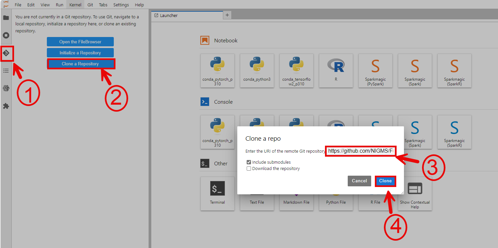

## Contents

+ [Getting Started](#getting-started)
+ [Creating a notebook instance with R kernel in Azure](#creating-a-notebook-instance-with-r-kernel-in-azure)
+ [Creating Azure Blob Storage](#creating-azure-blob-storage)
+ [Azure Architecture](#azure-architecture)

## Getting Started
Each learning submodule will be organized in an R Jupyter notebook with step-by-step hands-on practice with R command line to install necessary tools, obtain data, perform analyses, visualize and interpret the results. The notebook will be executed in the Azure environment. Therefore, the first step is to set up a notebook instance in Machine Learning Studio.

<!-- #region -->
## Creating a notebook instance with R kernel in Azure

Follow the steps highlighted [here](https://github.com/NIGMS/NIGMS-Sandbox/blob/main/docs/HowToCreateAzureMLNotebooks.md) to create a new notebook instance in Azure Machine Learning Studio. Follow steps and be especially careful to enable idle shutdown as highlighted. For this module, in step 6 in the "Notebook instance type" tab, select 'Standard_DS3_v2' from the dropdown box.

The Machine Learning Studio Jupyter Notebooks already have an R kernel available which we will use and install our packages to.


Follow the steps highlighted in part two (2. Spin up Instance from a Container) of [here](https://github.com/NIGMS/NIGMS-Sandbox/blob/main/docs/HowToCreateAzureMLNotebooks.md) to create a new notebook instance in Machine Learning Studio. Follow steps 1-8, in step 5 select region us-east4 (Northern Virginia) and be especially careful to use custom container `us-east4-docker.pkg.dev/nih-cl-shared-resources/nigms-sandbox/nigms-vertex-r` in step 6 under the Docker container image prompt. In step 7 under the Machine type tab, select n1-standard-4 from the dropdown box. In step 8, be careful to **Enable Idle Shutdown**. After creating the notebook, you can click on **OPEN JUPYTERLAB**.

### Downloading and Running Tutorial Files

Now that you have successfully created your virtual machine, you will be directed to Jupyterlab screen. The next step is to import the notebooks and start the course. 
This can be done by selecting the __Git__ from the top menu in Jupyterlab, and choosing the __Clone a Repository__ 
option. Next, you can copy and paste in the link of the repository: `https://github.com/NIGMS/Consensus-Pathway-Analysis-in-the-Cloud.git` and click __Clone__.



This will download the repository to your JupyterLab folder. All tutorial files for the five submodules are in Jupyter format with a .ipynb extension. Double-click each file to view the lab content and run the code. This will open the Jupyter file in a Jupyter notebook. From here, you can run each section, or "cell", of the code, one by one, by pressing the "Play" button in the menu above.


Some 'cells' of code take longer for the computer to process than others. You will know a cell is running when a cell has an asterisk next to it \[\*\]. When the cell finishes running, that asterisk will be replaced with a number which represents the order that cell was run in. You can now explore the tutorials by running the code in each, from top to bottom. Look at the 'workflows' section below for a short description of each tutorial.

Jupyter is a powerful tool, with many useful features. For more information on how to use Jupyter, we recommend 
searching for Jupyter tutorials and literature online.

### Stopping Your Virtual Machine

When you are finished running code, you should turn off your notebook to prevent unnecessary billing or resource use by checking your notebook and pushing the __STOP__ button.

## Creating Azure Blob Storage
In this section, we will describe the steps to create Azure Blob Storage to store data generated during analysis.  The storage can be created via GUI or using the command line.

Azure Storage is comprised of three parts: accounts, containers, and blobs, as seen in the image below. Accounts contain containers which act as folders. Containers hold files, aka blobs and folders or subfolders.


When you create the Azure Machine Learning service, it will automatically create a storage account under the name of the workspace you created before. This allows you to either use the previously made storage account or create a new one. Instructions for both options are outlined below.
**Option 1:Using a Premade Storage Accounts**
1. On the webpage of your Azure account, find and select `Azure Storage Accounts`.
2. Find and click the storage account that is labeled the same as your Machine learning service.

4. Navigate to `Containers` on the left side menu.
5. The console will list all the containers and files created as shown in the figure below. Some of these containers and files are automatically created when we create our Machine Learning Service:

6. Click `+ Container` to create and name a new container.

7. Click on the new container, then click `Upload` to upload files.


**Option 2: Creating a New Storage Account**
1. On the webpage of your Azure account, find and select `Azure Storage Accounts`.
2. Select `CREATE` button to create a new storage account.
3. Enter the information such as Subscription, resource group, and storage account name. Make sure the storage name is unique.
4. For Primary Service, select 'Azure Blob Storage'.
5. For Performance, select 'Standard'.
6. For Redundancy, select 'Locally-redundant Storage (LRS)'. Note that users can define the access control in this step, and edit the access later once users want to share their data.
7. Click `CREATE`.
8. Navigate to your storage account, then click on 'Containers' on the left side menu.
9. Click `+ Container` to create and name a new container.
10. Click on the new container, then click `Upload` to upload files.

**Option 3: Using the Azure CLI**
1. Create or use a premade storage account
2. Run `system(az login, inter = TRUE)` in the terminal and follow the prompt to authenticate.
3. Run `system("az storage container create --account-name <STORAGE-ACCOUNT-NAME> --name <CONTAINER-NAME>", intern = TRUE)` in your Jupyter notebook or the terminal to create your container
4. Run `system("az storage blob upload --account-name <STORAGEACCOUNT-NAME> --container-name <CONTAINER-NAME> --name <FILE-NAME> --file <LOCAL-FILE-PATH>")` in your Jupyter notebook or the terminal to upload your files to your blob storage


Once the uploading is done, users if they haven't already must authenticate by running `az login` then load the data to their instance by running the following command syntax in an R code block: `system("az storage blob download --account-name <STORAGEACCOUNT-NAME> --container-name <CONTAINER-NAME> --name <FILE-NAME> --file <DESTINATION>", intern = TRUE)`. For example, we run the following command lines to load the dataset GSE5281 we store in the Azure Blob Storage:

```
# Download the files from Blob Storage to the "data" folder in the current directory
system("az storage blob download --account-name  --container-name data --name GSE5281.csv --file ./data/GSE5281.csv", intern = TRUE)
system("az storage blob download --account-name  --container-name data --name GSE5281_SampleInfo.csv  --file ./data/GSE5281_SampleInfo.csv", intern = TRUE)
```

You can learn more about `az storage` commands by reading the article [here](https://learn.microsoft.com/en-us/azure/storage/blobs/storage-quickstart-blobs-cli).

## Azure Architecture

# 
The figure above shows the architecture of the learning module with Azure infrastructure. First, we will create
an Machine Learning Studio Jupyter Notebook with R kernel. The code and instructions for each submodule are presented in a separate Jupyter Notebook.
User can either upload the Notebooks to the Machine Learning Studio Notebooks or clone from the project repository. Then, users can execute 
the code directly in the Notebook. In our learning course, the submodule 01 will download data from the public repository (e.g., GEO database)
for preprocessing and save the processed data to a local file in Machine Learning Studio and to the user's Azure Storage Container. The output
of the submodule 01 will be used as inputs for all other submodules. The outputs of the submodules 02, 03, and 04 will be saved to 
local repository in Machine Learning Studio Notebooks and the code to copy them to the user's cloud storage is also included.
<!-- #endregion -->

```python

```
