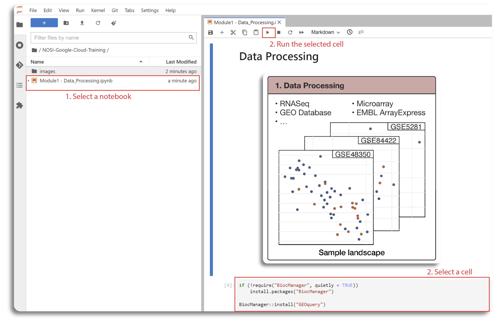
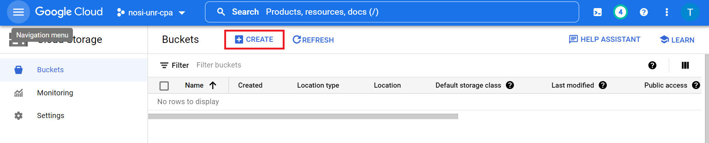

## Contents

+ [Getting Started](#getting-started)
+ [Creating a notebook instance with R kernel in Google Cloud](#notebook-instance)
+ [Creating Google Cloud Storage Buckets](#google-cloud-bucket)
+ [Google Cloud Architecture](#google-cloud-architecture)

## Getting Started

Each learning submodule will be organized in an R Jupyter notebook with step-by-step hands-on practice using R command-line tools to install necessary tools, obtain data, perform analyses, visualize, and interpret the results. The notebook will be executed in the Google Cloud environment. Therefore, the first step is to set up a notebook instance in Vertex AI.

## Creating a notebook instance with R kernel in Google Cloud

Follow the steps highlighted in the second part (2. Spin up Instance from a Container) of [this guide](https://github.com/NIGMS/NIGMS-Sandbox/blob/main/docs/HowToCreateVertexAINotebooks.md) to create a new notebook instance in Vertex AI. Follow steps 1–8. In step 5, select the `us-east4` (Northern Virginia) region.  In step 6, be especially careful to use the custom container `us-east4-docker.pkg.dev/nih-cl-shared-resources/nigms-sandbox/nigms-vertex-r` in the Docker container image prompt. In step 7, under the Machine type tab, select `n1-standard-4` from the dropdown box. In step 8, be sure to **enable Idle Shutdown**. After creating the notebook, you can click on **OPEN JUPYTERLAB**.

### Downloading and Running Tutorial Files

Now that you have successfully created your virtual machine, you will be directed to the JupyterLab screen. The next step is to import the notebooks and start the course. This can be done by selecting **Git** from the top menu in JupyterLab and choosing the **Clone a Repository** option.  Next, copy and paste the repository link: `https://github.com/NIGMS/Consensus-Pathway-Analysis-in-the-Cloud.git` and click **Clone**.

This will download the repository to your JupyterLab folder. All tutorial files for the five submodules are in Jupyter format with a *.ipynb* extension. Double-click each file to view the lab content and run the code. This will open the Jupyter file in a Jupyter notebook. From here, you can run each section, or "cell," of the code, one by one, by pressing the "Play" button in the menu above.

Some code cells take longer to process than others.  A cell is running when an asterisk (*) appears next to it. When the cell finishes running, the asterisk will be replaced with a number indicating the order in which the cell was run. You can now explore the tutorials by running the code in each cell from top to bottom. See the "workflows" section below for a short description of each tutorial.

Jupyter is a powerful tool with many useful features. For more information on how to use Jupyter, we recommend searching for Jupyter tutorials and documentation online.

### Stopping Your Virtual Machine

When finished running code, turn off your notebook to prevent unnecessary billing or resource use. Locate your notebook and click the **STOP** button.

## Creating Google Cloud Storage Buckets

This section describes how to create Google Cloud Storage buckets to store data generated during analysis.  Buckets can be created via the GUI or using the command line.

To use the GUI, visit [https://console.cloud.google.com/storage/](https://console.cloud.google.com/storage/), sign in, and click **Buckets** in the left-hand menu.

Next, click the **CREATE** button below the search bar to create a new bucket.

This opens a page where you provide a unique bucket name, location, access control, and other information.  We named our bucket `cpa-output` (remember to create your own unique bucket name).  Click **CREATE** to complete the process.

To create a bucket using the command line, use the `gcloud storage buckets create` command:  `gcloud storage buckets create gs://BUCKET_NAME`, where `BUCKET_NAME` is your user-defined name. A success message indicates a successful request. You can add optional flags for greater control: `--project: PROJECT_NAME`, `--default-storage-class: STORAGE_CLASS`, `--location: LOCATION`, and `--uniform-bucket-level-access`.  `PROJECT_NAME` and `STORAGE_CLASS` are user-supplied.

Storage buckets can also be created using the `gsutil mb` command: `gsutil mb gs://BUCKET_NAME`. This command also returns a success message and accepts optional flags `-p`, `-c`, `-l`, and `-b` corresponding to project ID or number, default storage class, location, and uniform bucket-level access, respectively.

## Google Cloud Architecture

The figure above shows the architecture of the learning module using Google Cloud infrastructure. First, a Vertex AI Workbench with an R kernel is created. The code and instructions for each submodule are presented in a separate Jupyter Notebook. Users can upload the notebooks to the Vertex AI Workbench or clone them from the project repository.  Then, users can execute the code directly in the notebook. In our learning course, submodule 01 downloads data from a public repository (e.g., GEO database), preprocesses it, and saves the processed data to a local file in the Vertex AI Workbench and to the user's Google Cloud Storage bucket. The output of submodule 01 is used as input for all other submodules. The outputs of submodules 02, 03, and 04 are saved to the local repository in the Vertex AI Workbench, and code to copy them to the user's cloud bucket is included.