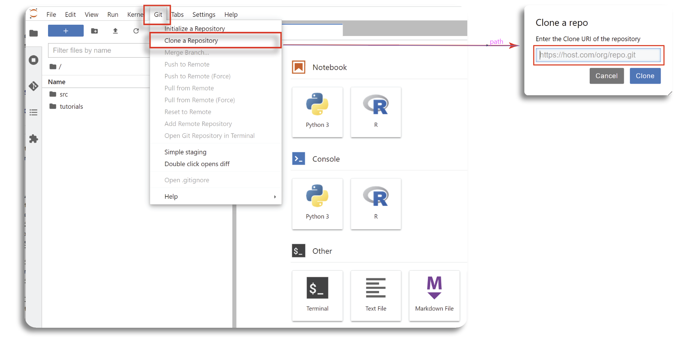
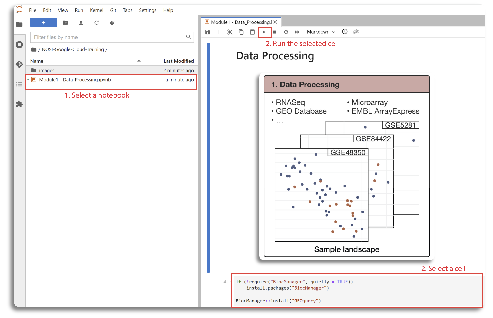
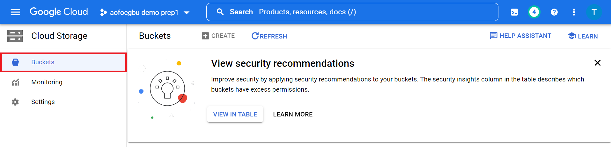
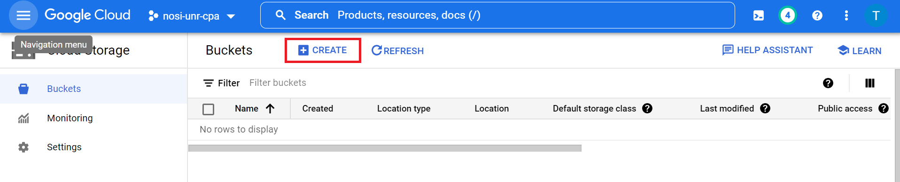

## Contents

+ [Getting Started](#getting-started)
+ [Creating a notebook instance with R kernel in Google cloud](#notebook-instance)
+ [Creating Google Cloud Storage Buckets](#google-cloud-bucket)
+ [Google Cloud Architecture](#google-cloud-architecture)

## Getting Started
Each learning submodule will be organized in an R Jupyter notebook with step-by-step hands-on practice with R command line to install necessary tools, obtain data, perform analyses, visualize and interpret the results. The notebook will be executed in the Google Cloud environment. Therefore, the first step is to set up a notebook instance in VertexAI.

## Creating a notebook instance with R kernel in Google cloud

Follow the steps highlighted in the second part (2. Spin up Instance from a Container) of [here](https://github.com/NIGMS/NIGMS-Sandbox/blob/main/docs/HowToCreateVertexAINotebooks.md) to create a new notebook instance in Vertex AI. Follow steps 1-8, in step 5 select region us-east4 (Northern Virgina) and be especially careful to use custom container `us-east4-docker.pkg.dev/nih-cl-shared-resources/nigms-sandbox/nigms-vertex-r` in step 6 under the Docker container image prompt. In step 7 under the Machine type tab, select n1-standard-4 from the dropdown box. In step 8, be carefull to **Enable Idle Shutdown**. After creating the notebook you can click on **OPEN JUPYTERLAB**.

### Downloading and Running Tutorial Files

Now that you have successfully created your virtual machine, and you will be directed to Jupyterlab screen. 
The next step is to import the notebooks and start the course. 
This can be done by selecting the __Git__ from the top menu in Jupyterlab, and choosing the __Clone a Repository__ 
option. 
Next you can copy and paste in the link of repository: `https://github.com/NIGMS/Consensus-Pathway-Analysis-in-the-Cloud.git` and click __Clone__.

This should download our repository to Jupyterlab folder. All tutorial files for five sub-module are in Jupyter 
format with *.ipynv* extension . Double click on each file to view the lab content and running the code. This will 
open the Jupyter file in Jupyter notebook. From here you can run each section, or 'cell', of the code, one by one, 
by pushing the 'Play' button on the above menu.

Some 'cells' of code take longer for the computer to process than others. You will know a cell is running when a cell 
has an asterisk next to it \[\*\]. When the cell finishes running, that asterisk will be replaced with a number which 
represents the order that cell was run in. You can now explore the tutorials by running the code in each, from top to 
bottom. Look at the 'workflows' section below for a short description of each tutorial.

Jupyter is a powerful tool, with many useful features. For more information on how to use Jupyter, we recommend 
searching for Jupyter tutorials and literature online.

### Stopping Your Virtual Machine

When you are finished running code, you should turn off your notebook to prevent unneeded billing or resource 
use by checking your notebook and pushing the __STOP__ button.

## Creating Google Cloud Storage Buckets
In this section, we will describe the steps to create Google Cloud Storage Buckets to store data generated during 
analysis.  The bucket can be created via GUI or using the command line.
To use the GUI, the user has to first visit https://console.cloud.google.com/storage/, sign in, click on __Buckets__ 
on the left menu.

# 
Next, click on the __CREATE__ button below the search bar to start creating a new bucket.

# 

This will then open a page where the user will provide the unique name of the bucket, the
location, access control and other information about the bucket. Here, we named our bucket as _cpa-output_ (please remember to create your own since all buckets are meant to have unique names). After this 
the user will click on the __CREATE__ button to complete the process.

# 

To create a Bucket using the command line, the user can use the gcloud storage buckets `create` command
`gcloud storage buckets create gs://BUCKET_NAME` where `BUCKET_NAME` is the user-defined name. 
If the request succeeds, the user gets a success message. The user can also add optional flags
while running the `create command ` to have greater control over the creation of the bucket.
Such flags include `--project: PROJECT_NAME`, `--default-storage-class: STORAGE_CLASS`, `--location: LOCATION`
and `--uniform-bucket-level-access` with `PROJECT_NAME` and `STORAGE_CLASS` supplied by the user.

Storage Buckets can also be created on the command line using the `gsutils mb` command.
The command to do so is `gsutil mb gs://BUCKET_NAME`, with `BUCKET_NAME` the desired bucket name.
This command also returns a success message upon completion and can also take optional flags 
`-p`, `-c`, `-l`, `-b` and their user-supplied values, corresponding to project ID or number, default storage class, 
location of the bucket and 
uniform bucket-level access respectively, just like the `create` command.

## Google Cloud Architecture

# 
The figure above shows the architecture of the learning module with Google Cloud infrastructure. First, we will create
an VertexAI workbench with R kernel. The code and instruction for each submodule is presented in a separate Jupyter Notebook.
User can either upload the Notebooks to the VertexAI workbench or clone from the project repository. Then, users can execute 
the code directly in the Notebook. In our learning course, the submodule 01 will download data from the public repository (e.g., GEO database)
for preprocessing and save the processed data to a local file in VertexAI workbench and to the user's Google Cloud Storage Bucket. The output
of the submodule 01 will be used as inputs for all other submodules. The outputs of the submodules 02, 03, and 04 will be saved to 
local repository in VertexAI workbench and the code to copy them to the user's cloud bucket is also included.