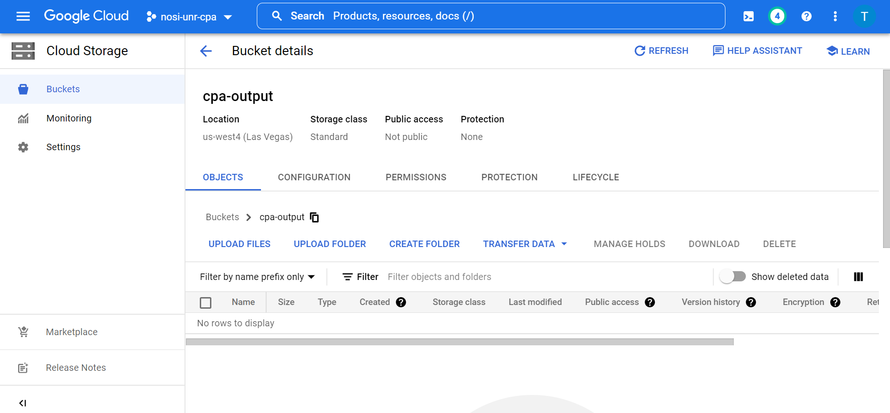
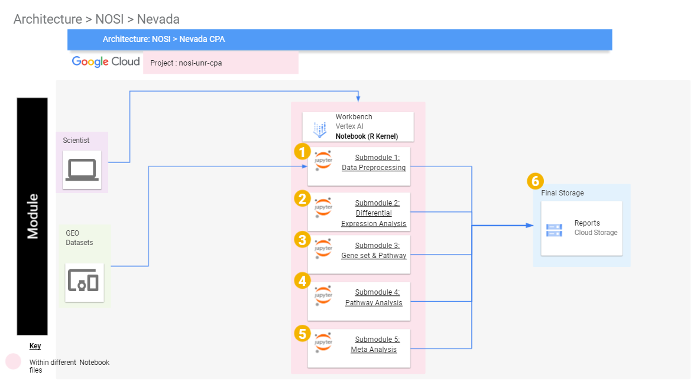

# Consensus Pathway Analysis using Google Cloud Infrastructure
Authors: Ha Nguyen, Van-Dung Pham, Hung Nguyen, Bang Tran, Nicole Schrad, Juli Petereit, and Tin Nguyen

This cloud-based learning module teaches pathway analysis, a term that describes the set of tools and techniques used in
life sciences research to discover the biological mechanism behind a condition from high throughput biological data. 
Pathway Analysis tools are primarily used to analyze these omics datasets to detect relevant groups of genes that are 
altered in case samples when compared to a control group. Pathway analysis approaches make use of already existing pathway 
databases and given gene expression data to identify the pathways which are significantly impacted in a given condition.

This module will cost you about $1.00 to run, assuming you shut down and delete all resources at the end of your analysis.

Watch this [Introduction Video](https://youtu.be/fs5YamLHPcA) to learn more about the module.

The course is structured such that the content will be arranged in five submodules which allows us to:
1. Download and process data from public repositories,
2. Perform differential analysis,
3. Perform pathway analysis using different methods that seek to answer different research hypotheses,
4. Perform meta-analysis and combine methods and datasets to find consensus results, and
5. Interactively explore significantly impacted pathways across multiple analyses, and browsing relationships between 
pathways and genes.

## Overview of Page Contents

+ [Getting Started](#getting-started)
+ [Google Cloud](#google-cloud)
+ [Workflow Diagrams](#workflow-diagrams)
+ [Google Cloud Architecture](#google-cloud-architecture)
+ [Software Requirements](#software-requirements)
+ [Data](#data)
+ [Troubleshooting](#troubleshooting)
+ [Funding](#funding)
+ [License](#license-for-data)

## Getting Started
Each learning submodules will be organized in a R Jupyter notebook with step-by-step hands-on practice with R command 
line to install necessary tools, obtain data, perform analyses, visualize and interpret the results. The notebook will 
be executed in the Google Cloud environment. Therefore, the first step is to set up a virtual machine VertexAI.

## Google Cloud

### Navigating to the Vertex AI Workbench
You can begin by first navigating to https://console.cloud.google.com/ and logging in with your credentials. Next, follow the directions in the [STRIDES tutorial on setting up a Vertex AI notebook](https://github.com/STRIDES/NIHCloudLabGCP/blob/main/docs/vertexai.md). This will walk you through the basics of cloud platforms and provide links for setting up the environment. Be especially careful to enable idle shutdown as highlighted in step 7. For this module you should select Debian 10 and R 4.2 in the Environment tab in step 5. We recommend the n1-standard-4 machine type in step 6 with 4 vCPUs and 15GB of RAM.

### Downloading and Running Tutorial Files

Now that you have successfully created your virtual machine, and you will be directed to Jupyterlab screen. 
The next step is to import the notebooks and start the course. 
This can be done by selecting the __Git__ from the top menu in Jupyterlab, and choosing the __Clone a Repository__ 
option. 
Next you can copy and paste in the link of repository: `https://github.com/NIGMS/Consensus-Pathway-Analysis-in-the-Cloud.git` and click __Clone__.


This should download our repository to Jupyterlab folder. All tutorial files for five sub-module are in Jupyter 
format with *.ipynv* extension . Double click on each file to view the lab content and running the code. This will 
open the Jupyter file in Jupyter notebook. From here you can run each section, or 'cell', of the code, one by one, 
by pushing the 'Play' button on the above menu.


Some 'cells' of code take longer for the computer to process than others. You will know a cell is running when a cell 
has an asterisk next to it \[\*\]. When the cell finishes running, that asterisk will be replaced with a number which 
represents the order that cell was run in. You can now explore the tutorials by running the code in each, from top to 
bottom. Look at the 'workflows' section below for a short description of each tutorial.

Jupyter is a powerful tool, with many useful features. For more information on how to use Jupyter, we recommend 
searching for Jupyter tutorials and literature online.

### Stopping Your Virtual Machine

When you are finished running code, you should turn off your virtual machine to prevent unneeded billing or resource 
use by checking your notebook and pushing the __STOP__ button.

## Workflow Diagrams

The content of the course is organized in R Jupyter Notebooks. Another way to view this module is Jupyter Book which is a package to combine 
individuals Jupyter Notebooks into a web-interface for a better navigation, this is only to view the notebook not to run it. Details of installing the tools and formatting
the content can be found at: https://jupyterbook.org/en/stable/intro.html. The content of the course is reposed in the 
Github repository of Dr. Tin Nguyen's lab, and can be found at https://github.com/tinnlab/NOSI-Google-Cloud-Training.
The overall structure of the modules is explained below:

+ [**Submodule 01**](./Submodule01-ProcessingExpressionData.ipynb) describes how to obtain data from public repository, process 
+ and save the expression matrix and shows how to map probe IDs into gene symbols.
+ [**Submodule 02**](./Submodule02-DifferentialAnalysis.ipynb) focuses on Differential Expression Analysis using `limma`, `t-test`, 
`edgeR`, and `DESeq2`.
+ [**Submodule 03**](./Submodule03-ProcessingPathwayInformation.ipynb) introduces common curated biological databases such as Gene 
+ Ontology (GO), Kyoto Encyclopedia of Genes, and REACTOME.
Genomes (KEGG)
+ [**Submodule 04**](./Submodule04-PathwayAnalysis.ipynb) aims at performing Enrichment Analysis methods using popular 
+ methods such as `ORA`, `FGSEA`, and `GSA`.
+ [**Submodule 05**](./Submodule05-MetaAnalysis.ipynb) aims at performing Meta-analysis using multiple datasets.

# 

## Creating Google Cloud Storage Buckets
In this section, we will describe the steps to create Google Cloud Storage Buckets to store data generated during 
analysis.  The bucket can be created via GUI or using the command line.
To use the GUI, the user has to first visit https://console.cloud.google.com/storage/, sign in, click on __Buckets__ 
on the left menu.

# 
Next, click on the __CREATE__ button below the search bar to start creating a new bucket.

# 

This will then open a page where the user will provide the unique name of the bucket, the
location, access control and other information about the bucket. Here, we named our bucket as _cpa-output_ (please remember to create your own since all buckets are meant to have unique names). After this 
the user will click on the __CREATE__ button to complete the process.

# 

To create a Bucket using the command line, the user can use the gcloud storage buckets `create` command
`gcloud storage buckets create gs://BUCKET_NAME` where `BUCKET_NAME` is the user-defined name. 
If the request succeeds, the user gets a success message. The user can also add optional flags
while running the `create command ` to have greater control over the creation of the bucket.
Such flags include `--project: PROJECT_NAME`, `--default-storage-class: STORAGE_CLASS`, `--location: LOCATION`
and `--uniform-bucket-level-access` with `PROJECT_NAME` and `STORAGE_CLASS` supplied by the user.

Storage Buckets can also be created on the command line using the `gsutils mb` command.
The command to do so is `gsutil mb gs://BUCKET_NAME`, with `BUCKET_NAME` the desired bucket name.
This command also returns a success message upon completion and can also take optional flags 
`-p`, `-c`, `-l`, `-b` and their user-supplied values, corresponding to project ID or number, default storage class, 
location of the bucket and 
uniform bucket-level access respectively, just like the `create` command.

## Google Cloud Architecture

# 
The figure above shows the architecture of the learning module with Google Cloud infrastructure. First, we will create
an VertexAI workbench with R kernel. The code and instruction for each submodule is presented in a separate Jupyter Notebook.
User can either upload the Notebooks to the VertexAI workbench or clone from the project repository. Then, users can execute 
the code directly in the Notebook. In our learning course, the submodule 01 will download data from the public repository (e.g., GEO database)
for preprocessing and save the processed data to a local file in VertexAI workbench and to the user's Google Cloud Storage Bucket. The output
of the submodule 01 will be used as inputs for all other submodules. The outputs of the submodules 02, 03, and 04 will be saved to 
local repository in VertexAI workbench and the code to copy them to the user's cloud bucket is also included.

# Software Requirements
This learning module requires some computational hardware and local environment setting from users as the 
programs and scripts but this is easily provided during the notebook set up explained above. The browser-based development environment provided by Google. However, 
users need to have Google email account, sufficient internet access, and a standard web-browser (e.g., Chrome, Edge, 
Firefox etc., Chrome browser is recommended) to create a Cloud Virtual Machine for analysis. It is recommended to 
execute the Jupyter NoteBook using R kernel version > 4.1 using a standard machine 
with minimum configuration of 4 vCPUs, 15 GB RAM, and 10GB of HDD.

The following are the R and tool versions used to run this module at the time of development:

```
R version 4.2.2 (2022-10-31)
Platform: x86_64-pc-linux-gnu (64-bit)
Running under: Debian GNU/Linux 10 (buster)

attached base packages:
[1] stats4    stats     graphics  grDevices utils     datasets  methods 
[8] base    
 
other attached packages:
[1] GSA_1.03.2            fgsea_1.24.0          BiocManager_1.30.20 
 [4] lubridate_1.9.2       forcats_1.0.0         stringr_1.5.0       
 [7] dplyr_1.1.0           purrr_1.0.1           readr_2.1.4         
[10] tidyr_1.3.0           tibble_3.2.0          ggplot2_3.4.1       
[13] tidyverse_2.0.0       hgu133plus2.db_3.13.0 org.Hs.eg.db_3.16.0 
[16] AnnotationDbi_1.60.2  IRanges_2.32.0        S4Vectors_0.36.2    
[19] Biobase_2.58.0        BiocGenerics_0.44.0 
 
loaded via a namespace (and not attached):
[1] httr_1.4.5             bit64_4.0.5            vroom_1.6.1          
 [4] jsonlite_1.8.4         blob_1.2.3             GenomeInfoDbData_1.2.9
[7] pillar_1.8.1           RSQLite_2.3.0          lattice_0.20-45      
[10] glue_1.6.2             uuid_1.1-0             digest_0.6.31        
[13] XVector_0.38.0         colorspace_2.1-0       cowplot_1.1.1        
[16] htmltools_0.5.4        Matrix_1.5-1           pkgconfig_2.0.3      
[19] zlibbioc_1.44.0        scales_1.2.1           tzdb_0.3.0           
[22] BiocParallel_1.32.6    timechange_0.2.0       KEGGREST_1.38.0      
[25] farver_2.1.1           generics_0.1.3         ellipsis_0.3.2        
[28] cachem_1.0.7           withr_2.5.0            repr_1.1.6           
[31] cli_3.6.0              magrittr_2.0.3         crayon_1.5.2         
[34] memoise_2.0.1          evaluate_0.20          fansi_1.0.4          
[37] tools_4.2.2            data.table_1.14.8      hms_1.1.2            
[40] lifecycle_1.0.3        munsell_0.5.0          Biostrings_2.66.0    
[43] compiler_4.2.2         GenomeInfoDb_1.34.9    rlang_1.0.6          
[46] grid_4.2.2             RCurl_1.98-1.10        pbdZMQ_0.3-9         
[49] IRkernel_1.3.2         labeling_0.4.2         bitops_1.0-7         
[52] base64enc_0.1-3        gtable_0.3.1           codetools_0.2-18     
[55] DBI_1.1.3              R6_2.5.1               fastmap_1.1.1        
[58] bit_4.0.5              utf8_1.2.3             fastmatch_1.1-3      
[61] stringi_1.7.12         parallel_4.2.2         IRdisplay_1.1        
[64] Rcpp_1.0.10            vctrs_0.5.2            png_0.1-8            
[67] tidyselect_1.2.0
 
```
## Data
All data from the modules were originally downloaded from the Gene Expression Omnibus (GEO) repository using the accession
number GSE48350 file. The data was originally generated by **Berchtold and Cotman, 2013**. We preprocessed this data and
normalized it, after which we used it in the subsequent analyses.

## Troubleshooting

Some common errors include:
- Having the Jupyter Notebook kernel defaulting to Python and libraries not loading properly. 
- To fix the kernel, check that the upper right hand corner of the edit ribbon says "R". If it doesn't work, you can click the words next to the circle (O) to change the kernel.
- When there are problems loading a library, check that the package has been properly installed. 
- If some gsutil commands do not work try writing the command using the system function to run bash commands in R: `system("gsutil or bash command", intern= TRUE)`.
- If you run into error when creating your bucket it may be due to a existing bucket with the same name to resolve this choose another unique name for your bucket
- Packages can usually be downloaded by the instructions in the documentation. 
- Other errors that may happen are usually due to grammatical errors such as capitalization or spelling errors. 

## Funding

This work was fully supported by NIH NIGMS under grant number GM103440. Any opinions, findings, and conclusions, 
or recommendations expressed in this material are those of the authors and do not necessarily reflect the views 
of any of the funding agencies.

## License for Data

Text and materials are licensed under a Creative Commons CC-BY-NC-SA license. The license allows you to copy, remix and redistribute any of our publicly available materials, under the condition that you attribute the work (details in the license) and do not make profits from it. More information is available [here](https://tilburgsciencehub.com/about).


This work is licensed under a [Creative Commons Attribution-NonCommercial-ShareAlike 4.0 International License](http://creativecommons.org/licenses/by-nc-sa/4.0/)
